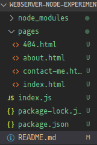
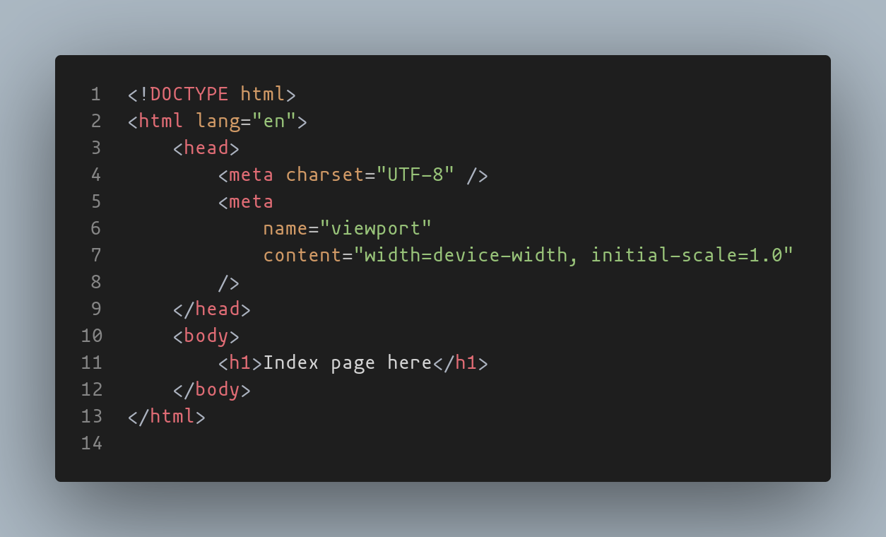
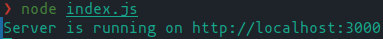
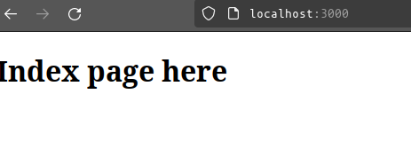
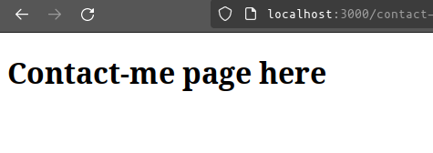
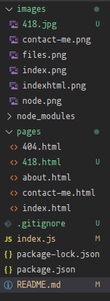

# web server node exercise

An exercise in the use of node.js, and express, setting up a web server.

A short and simple web server deployed using a node.js/express web server solution.

The process of setting up a web server using node.js and express can seem daunting at first, but the process can be straight forward using some appropriate techniques:

## Step 1. The setup

First of, having node installed is a given, [read more about that here](https://nodejs.org/en)

Then we initialize node in the root of our project:

```
 npm init -y
```

using the -y flag (or yes flag) will effectively answer yes to all the initializer questions, feel free to omit the -y flag to gain more fine control over the initialization.

With node and NPM set up, were now ready to begin installing packages!
Now, in order to set up a basic web server, we needed two packages in particular:

```
npm install express fs
```

-   Express is the most popular Node web framework, and is the underlying library for a number of other popular Node web frameworks. It provides mechanisms like handling HTTP verbs at different URL paths, integrating view rendering engines, setting common web application settings like ports, and more.
    -- [More on the express package](https://developer.mozilla.org/en-US/docs/Learn/Server-side/Express_Nodejs/Introduction)

-   The node:fs module enables interacting with the file system in a way modeled on standard POSIX functions.
    --[More on the fs package](https://nodejs.org/api/fs.html)

With this, our setup is complete!

## Step 2. The website

The website for this exercise will consist of 4 simple html pages
We create a pages folder, wherein we house 4 html pages.



These html files are almost identical in their individual setup, only the body has some differences so we actually render something.



## Step 3. the web server

When incorporating express into the process, we effectively forego the manual setup and use of setting up the server, and allow express to handle the HTTP requests and responses.

In order to start our new amazing website we need to serve them to the user, hence the web server.

Thanks to the leveraging of node.js we can do this in javascript!

And thanks to express, the whole process have been made even simpler!

So we make a index.js file in the root of our project (see image in step 2) and write up the web server logic:

```javascript
const express = require('express');
const path = require('path');
const app = express();

// use app.get to define routes to the appropriate pages
// the express methods will be chained where appropriate.

app.get('/', (req, res) => {
    res.sendFile(path.join(__dirname, 'pages', 'index.html'));
});
app.get('/contact-me', (req, res) => {
    res.sendFile(path.join(__dirname, 'pages', 'contact-me.html'));
});
app.get('/about', (req, res) => {
    res.sendFile(path.join(__dirname, 'pages', 'about.html'));
});

// A catch all using asterisk wild cart for 404 responses.
app.get('*', (req, res) => {
    res.status(404).sendFile(path.join(__dirname, 'pages', 'index.html'));
});
// start the server

const PORT = process.env.PORT || 3000;
app.listen(PORT, () => {
    console.log(`Server is running on http://localhost:${PORT}`);
});
```

### Let's break this down:

## 1. Import requirements

First of, we import the modules we got earlier first by requirement.

```javascript
const fs = require('fs');
const path = require('path');
const express = require('express');
const app = express();
```

This will allow us to reference these modules through the constants we have initialized.

The last two constants in particular leverage the power of express, and establish an app using express, unlocking all the underlying methods to be used. So from this point, we will use app, to access all of express methods, and in turn, use the power of nodejs.

## 2. use the express method from our app constant, app.get() to associate URLs with their assigned files.

The process of linking our URL paths to our file paths have been made a whole lot simpler, thanks to express.

We can associate URLs with HTMLs simply by leveraging the app.get() method, which will allow express to handle
the underlying logic of the HTTP request/response cycle.

For each page we want to assign we set up a app.get.

```javascript
app.get('/', (req, res) => {
    res.sendFile(path.join(__dirname, 'pages', 'index.html'));
});
app.get('/contact-me', (req, res) => {
    res.sendFile(path.join(__dirname, 'pages', 'contact-me.html'));
});
app.get('/about', (req, res) => {
    res.sendFile(path.join(__dirname, 'pages', 'about.html'));
});
```

And finally, we use a asterisk wildcart to handle any other requests and respond with our 404 page.

```javascript
app.get('*', (req, res) => {
    res.status(404).sendFile(path.join(__dirname, 'pages', 'index.html'));
});
```

Notice how multiple methods are chained.

res.status() and res.sendFile() are chained together to form a full response object.
res status fills out the header of the response with a 404 status code, while sendFile
attached the HTML to the response.

Simply put, express allows chaining together it's methods in order to form response objects to return!
Thanks to this, all the stuff about creating our own HTTP request/response logic, initializing the web server
handling request objects, searching htmlFiles arrays for the appropriate pages, reading the HTMLs
, handling errors and finally sending the finished response object, is cut down to 27 lines of code!

(Note this is not a typo, I left in 6. just to clarify how many steps we handled in just the above code.)

#### 6. Open the flood gates

In order to actually receive requests, we need to tell our app to listen for them at the ports.

This can be any port, and for security reasons these would best be held in a .env file to prevent accidentally sending dangerous information to malicious outsiders. In this case though, it's a local host, just us playing around, so we will just use port 3000 to listen to a request locally.

-   IF you ever intend to expose your system to the actual internet, ALWAYS take appropriate measures to secure your data.

```javascript
const PORT = process.env.PORT || 3000;
app.listen(PORT, () => {
    console.log(`Server is running on http://localhost:${PORT}`);
});
```

Through this, we initialize a global constant, PORT, either through a .env value, or a default value of 3000.
We then tell the server we initialized at the start to listen to this port, and send a notification of this to the console.

## 4. And were ready to serve!

With this, were ready to serve! To start this, we will have to tell node to start this program in runtime.
SO in your terminal, tell node to do just that with

```
node index.js
```

Telling node to run the index.js file, and it's contents.



And now, we can visit `http://localhost:3000/`and request a page using the URL paths

the index page (default path at url /)



The contact-me page(/contact-me url)



ETC.

# CONGRATULATIONS! Were now serving our website! And learnt why it's called a "web server"

## Bonus easter egg feature: Serving content like images and other files.

Express can easily serve images and similar content alongside HTML pages, as long as it knows where it is.

This can be done thanks to app.use

We add a image to our image directory in the file strcuture (418.jpg in my case)



And we add app.use before any routing

```javascript
app.use(express.static(path.join(__dirname, 'images')));
```

Now we can server any files in the images directory along with our html in our HTTP response objects!
